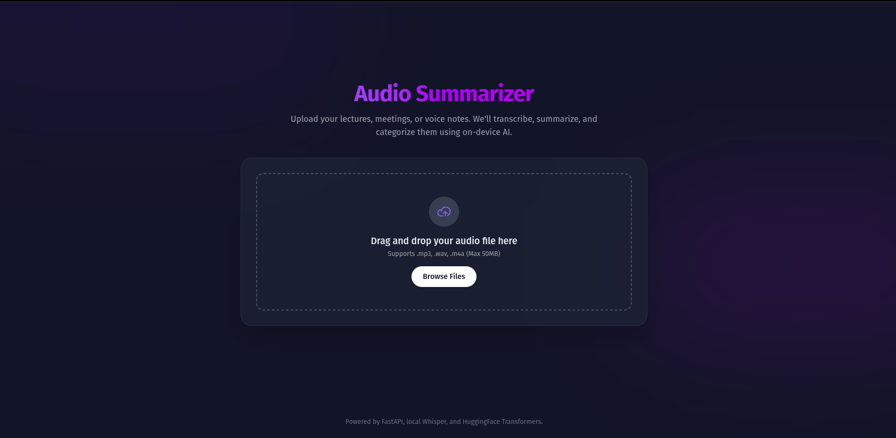
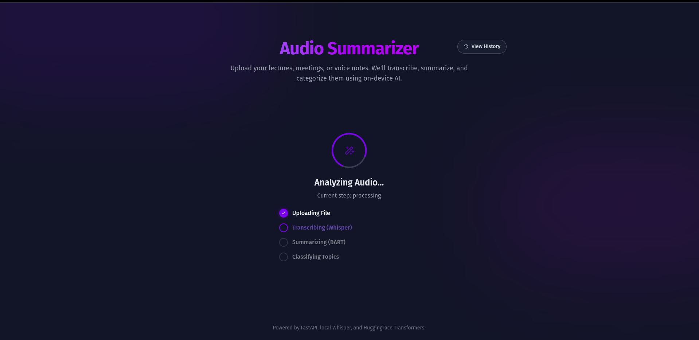
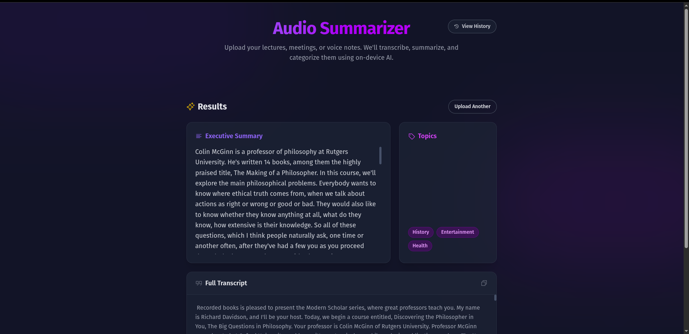
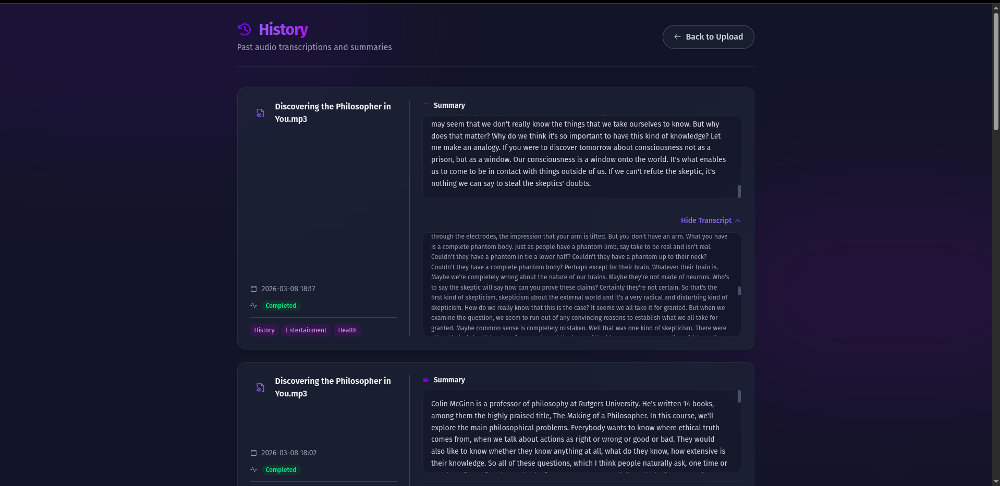
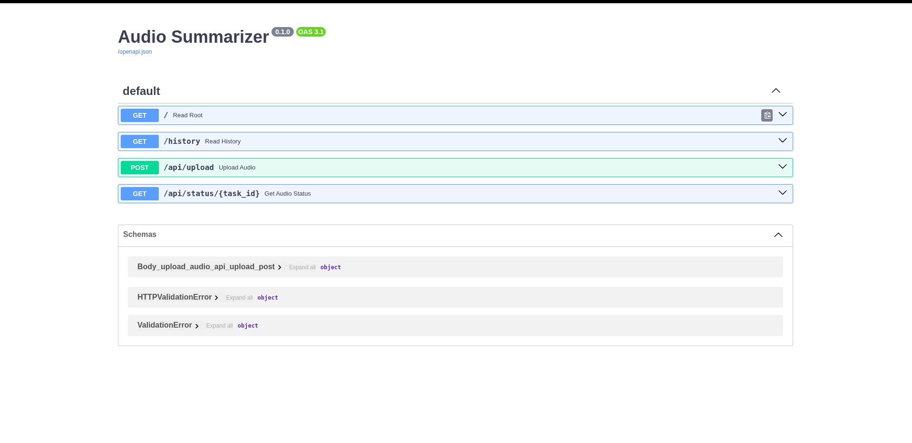

# 🎙️ Audio Summarizer & Classifier

A fast, fully-local AI application that transcribes, summarizes, and topic-classifies your audio files (lectures, voice notes, meetings) using FastAPI and on-device machine learning models. Built with a stunning, reactive glassmorphic UI.

## ✨ Features
* **Completely Local AI:** Runs entirely on your hardware. No API keys, no subscriptions, no cloud data anxiety.
* **Transcription:** High-accuracy transcription using OpenAI's `Whisper`.
* **Summarization:** Intelligent abstractive summarization using Hugging Face `BART-large-cnn`.
* **Zero-Shot Classification:** Automatically tags audio with topics (Technology, Business, Health, etc.) using `BART-large-mnli`.
* **Premium UI/UX:** Stunning, modern interface equipped with drag-and-drop feedback, smooth CSS stagger animations, crossfades, and interactive glassmorphic card hover effects.
* **History Log:** Includes an interactive `/history` page saving all past transcriptions logically to a SQLite database.

## 📸 Screenshots

### 1. Upload & Processing Flow
A sleek drag-and-drop interface with seamless transition animations as the AI processes your audio securely and locally.



### 2. Analysis Results
Once processing completes, the platform generates a scrolling Executive Summary, identified Topic tags, and a full transcript.


### 3. History Log
All jobs are saved dynamically to a local SQLite database, allowing you to re-visit past summaries and transcripts at any time via a beautiful staggered list view.


### 4. Developer API endpoint Definitions
Generated FastApi endpoint swagger documentation available at `/docs`.


## 🚀 Quick Setup & Installation

### Prerequisites
* Python 3.10+
* FFmpeg (required for `whisper` to process audio files)
  * Linux: `sudo apt update && sudo apt install ffmpeg`
  * macOS: `brew install ffmpeg`

### 1. Clone & Set Up Environment
```bash
# Set up virtual environment
python3 -m venv venv
source venv/bin/activate
```

### 2. Install Requirements
*Note: Installing PyTorch dependencies might take a few moments.*
```bash
pip install -r requirements.txt
```

### 3. Run the App
```bash
uvicorn main:app --host 0.0.0.0 --port 8000 --reload
```
Navigate to `http://localhost:8000` in your web browser. 

*(On first run, the app will download the AI models to your machine. Subsequent runs will load them instantly from cache.)*

## 🛠️ Tech Stack
* **Backend:** FastAPI, Python, SQLite
* **AI/ML:** PyTorch, Whisper (OpenAI), Transformers (Hugging Face)
* **Frontend:** HTML5, Tailwind CSS (via CDN), Vanilla Javascript, Phosphor Icons

## 🧠 Memory Optimizatons
The models are specifically configured with `expandable_segments:True` and `float16` precision to prevent CUDA fragmentation and allow you to run these powerful large models smoothly even on smaller consumer-grade GPUs!
